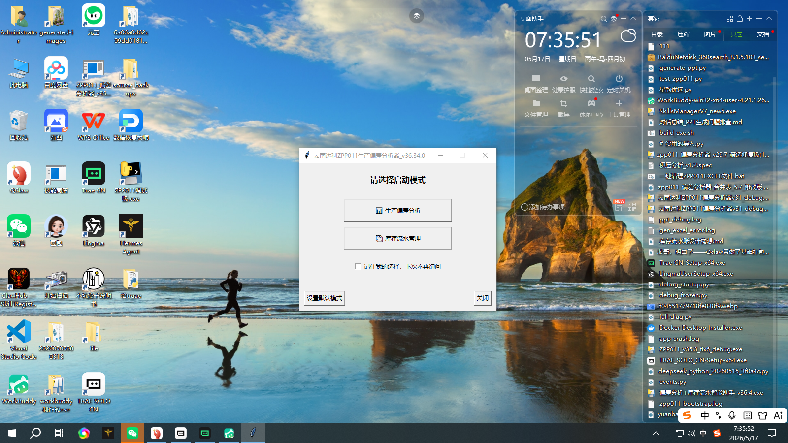

# ZPP011 生产偏差分析器

> 云南达利食品有限公司 — SAP 生产订单偏差自动分析与管理工具

---

## 📋 项目简介

一套基于 **Python + PySide6** 的生产偏差数据分析系统，对接 SAP 导出的标准配料报表（Excel），提供从数据导入、偏差计算、替代料净偏差抵消、AI 智能审核、多维度筛选到完整报告导出的一站式解决方案。

**核心场景**：食品/饮料生产车间每日需审核物料消耗偏差（实际 vs 定额），原来靠人工逐行比对 Excel，效率低且易漏。本系统将整个流程自动化，单次分析 5~30 秒，审核效率提升 10 倍以上。

---

## ✨ 核心功能

| 模块 | 功能说明 |
|------|----------|
| **📊 偏差分析** | 自动读取 SAP 导出 Excel，计算定额与实际偏差（数量 + 金额），支持多工厂/车间/物料分类 |
| **🔄 替代料净偏差** | 基于并查集（Union-Find）构建物料替代组，组内偏差自动抵消，准确反映真实损耗 |
| **🤖 AI 智能审核** | 自动为偏差行生成备注建议，支持批量审核、暂停/继续、分级判定（合格/需改进/已备注） |
| **🔍 多维度筛选** | 可折叠侧边栏，12 种筛选条件：工厂、车间、物料类型、偏差率范围、日期范围、替代料等 |
| **📋 审核管理** | 已读/未读标记（SQLite 持久化）、替代料看板、批量操作（标记/补备注/导出）、合计行、选中统计 |
| **📈 PPT 报告** | 一键生成 17 页汇报 PPT（含环形饼图、柱状图、偏差分布、预警等级、AI 归因摘要） |
| **📑 完整 Excel 导出** | 多 Sheet 输出（汇总统计、偏差明细、替代料明细、预警报表等 10+ Sheet + 颜色标记） |
| **💾 数据沉淀** | SQLite 历史库，支持历史对比、同期环/同比分析 |
| **🔔 实时预警** | 偏差率超阈值或替代料有差异时替代料看板弹窗提醒，支持批量标记已读 |

---

## 🏗 技术架构

```
┌──────────────────────────────────────────────┐
│              UI 层 (PySide6)                  │
│  main_window.py │ dialogs/ │ components/      │
├──────────────────────────────────────────────┤
│             模型层 (models/)                  │
│  DataFrameModel │ AuditProxyModel │ Workers   │
├──────────────────────────────────────────────┤
│             控制器层 (controllers/)           │
│  Analysis │ Audit │ Export │ AltMaterial      │
├──────────────────────────────────────────────┤
│             业务层                             │
│  analysis/analyzer.py │ core/ (AI审核/规则引擎)│
├──────────────────────────────────────────────┤
│             数据层                             │
│  storage/ │ services/ │ domain/ │ config/     │
└──────────────────────────────────────────────┘
```

**技术栈**：

| 层面 | 技术选型 |
|------|----------|
| GUI 框架 | PySide6 (Qt for Python) |
| 数据处理 | pandas, numpy |
| Excel 读写 | openpyxl, xlsxwriter |
| PPT 生成 | python-pptx |
| AI 接口 | 云端 API (兼容豆包/元宝等) |
| 持久化 | SQLite (审核状态 + 历史) + JSON (配置文件) |
| 打包发布 | PyInstaller → 单文件 EXE |

---

## 📁 项目结构

```
ZPP011_V36/
├── run_pyside6.py                  # 🚀 启动入口
├── build_pyside6_exe.py            # 📦 PyInstaller 打包脚本
├── gui_pyside6/                    # 🖥 PySide6 界面层
│   ├── main_window.py              #    主窗口
│   ├── components/                 #    UI 组件
│   │   ├── title_bar.py            #      自定义标题栏
│   │   ├── left_panel.py           #      左侧控制面板
│   │   ├── menu_bar.py             #      菜单栏
│   │   ├── main_table.py           #      数据表格
│   │   └── bottom_bar.py           #      状态栏
│   ├── controllers/                #    控制器
│   │   ├── analysis_controller.py  #      分析控制器
│   │   ├── audit_controller.py     #      审核控制器
│   │   ├── export_controller.py    #      导出控制器
│   │   └── alt_controller.py       #      替代料控制器
│   ├── dialogs/                    #    对话框
│   │   ├── alert_dialog.py         #      替代料看板
│   │   ├── dashboard_dialog.py     #      管理看板
│   │   ├── benefit_report_dialog.py#      效益报告
│   │   └── ... (10+ 个对话框)
│   ├── models/                     #    数据模型
│   │   ├── data_frame_model.py     #      DataFrame ↔ Qt 模型桥接
│   │   └── workers.py              #      后台线程
│   └── services/                   #    服务层
│       └── data_service.py         #      已读状态 + 指纹计算
├── analysis/                       # 📊 分析引擎
│   ├── analyzer.py                 #    核心分析逻辑
│   ├── net_offset.py               #    替代料净偏差计算 (Union-Find)
│   └── excel_builder/              #    多 Sheet 构建器
├── core/                           # 🧠 核心模块
│   ├── advanced_ppt_generator_v3.py#    PPT 报告生成
│   ├── ai_client.py                #    AI 审核客户端
│   ├── alert_monitor.py            #    预警监控
│   ├── rule_engine.py              #    备注规则引擎
│   ├── read_status.py              #    已读/未读状态管理
│   ├── history_db.py               #    SQLite 历史数据库
│   └── ... (20+ 模块)
├── config/                         # ⚙ 配置
│   ├── audit_cols_config.py        #    黄金模板列配置
│   ├── defaults.json               #    默认配置
│   └── system/rules.json           #    审核规则
├── utils/                          # 🛠 工具
│   └── version_history.py          #    版本号集中管理
├── tests/                          # 🧪 测试
├── docs/                           # 📖 文档
└── temp/                           # 🗑 临时文件
```

---

## 🚀 快速开始

### 环境要求

- **操作系统**：Windows 10 / 11
- **Python**：3.8+（推荐 3.10+）
- **输入数据**：SAP 导出的 Excel 文件（必须包含 `Data` 工作表）

### 安装依赖

```bash
git clone https://github.com/peishengqing/ZPP011_V36.git
cd ZPP011_V36
pip install -r requirements.txt
```

### 启动程序

```bash
python run_pyside6.py
```

### 打包为 EXE

```bash
# 普通模式（无控制台窗口）
python build_pyside6_exe.py

# 调试模式（带控制台，方便看错误日志）
python build_pyside6_exe.py --debug
```

打包输出在 `dist/` 目录，文件名格式：`ZPP011偏差分析器_v42.x_日期时间.exe`

---

## ⚙️ 配置说明

系统配置集中存储在用户目录：

| 配置文件 | 路径 | 说明 |
|----------|------|------|
| 用户配置 | `~/.zpp011_audit/config.json` | 阈值、颜色、路径等（自动生成） |
| 替代料配对 | `~/.zpp011_audit/alt_pairs.json` | 物料替代关系 |
| 审核数据库 | `~/.zpp011_audit/audit.db` | 已读/未读状态 + 历史数据 |
| 审核规则 | `config/system/rules.json` | 备注规则（图形界面可编辑） |
| 源码备份 | `~/.zpp011_audit/source_backups/` | 打包时自动备份（保留最近 20 份） |

---

## 📖 使用流程

```
1. 选择文件 → 2. 分析 → 3. 审核 → 4. 导出 → 5. 汇报
   │              │          │          │          │
   SAP Excel    自动计算    AI审核     Excel/PPT   PPT报告
   导入         偏差+替代料  标记已读   完整导出    一键生成
```

1. **打开文件** — 点击「选择文件」按钮，选取 SAP 导出的 Excel
2. **开始分析** — 点击「分析」，系统自动计算偏差、构建替代料组、生成审核表格
3. **审核处理** — 在表格中查看偏差记录，使用 AI 审核自动补备注，双击标记已读
4. **筛选关注** — 用侧边栏按工厂/车间/偏差率等维度过滤重点记录
5. **导出报告** — 点击「导出完整 Excel」生成多 Sheet 报告，或「生成 PPT 报告」一键出演示稿

---

## 🔄 版本历史

当前版本：**v42.7** (2026-06-11)

<details>
<summary>点击展开最近版本更新</summary>

### v42.7 (2026-06-11)
- ✦ 已读/未读 SQLite 持久化（跨 session 记忆）
- ✦ 预警看板右键菜单支持多选批量标记
- ✦ 历史源码入口 + 打包前自动备份源码
- 🔧 修复 15+ 启动错误（QMenu/QMessageBox/QShortcut 等导入）
- 🔧 修复 export_controller.py 语法错误
- 🔧 修复版本号分散在 5 处硬编码的问题

### v41.3 (2026-06-03)
- 🔧 修复批量操作、PPT 依赖、AI 审核规则等 9 项问题

### v41.2 (2026-06-03)
- ✦ PPT 报告 V3（17页模板）+ 效益报告（8页）
- 🔧 GBK 编码兜底 + 4 处 IndexError 修复

### v40.1 (2026-05-31)
- ✦ 管理看板、智能小结、合计行、成本换算器

完整版本日志请查看 `utils/version_history.py` 或程序内「帮助 → 关于」。

</details>

---

## 🖼 界面预览



*主窗口：左侧控制面板 + 右侧数据表格 + 底部状态栏*

---

## ⚠️ 注意事项

1. **数据格式** — 输入文件必须包含 `Data` 工作表，这是 SAP 标准导出格式
2. **AI 审核** — 需要网络连接，依赖云端 API。离线时仍可手动填写备注
3. **大数据量** — 单次分析建议不超过 10 万行，超过可能内存溢出
4. **打包体积** — EXE 约 140MB，因包含完整 Python 运行时及依赖库
5. **备份建议** — 打包前自动备份源码到 `~/.zpp011_audit/source_backups/`，保留最近 20 份

---

## 📝 常见问题

<details>
<summary>Q: 提示 "Worksheet named 'Data' not found"？</summary>
请确保选择的 Excel 文件包含名为 `Data` 的工作表。这是 SAP 标准导出格式，如果文件名不对，请先确认数据源。
</details>

<details>
<summary>Q: 分析进度卡在"替代料明细"？</summary>
数据量大时需等待 10~30 秒，属于正常现象。如果超过 5 分钟仍无响应，请检查替代料配对配置是否异常。
</details>

<details>
<summary>Q: 分析完成后表格为空？</summary>
检查：1) Excel 文件是否包含 `Data` 工作表；2) 日期范围设置是否与数据匹配；3) 列名是否符合 SAP 标准模板。
</details>

<details>
<summary>Q: 已读状态重启后丢失？</summary>
v42.7 已修复此问题。如果使用更早版本，请升级到最新版。已读状态存储于 `~/.zpp011_audit/audit.db`，请勿手动删除。
</details>

---

## 👤 作者

**裴盛清** — 云南达利食品有限公司

---

## 📄 许可证

内部使用，未开源。
